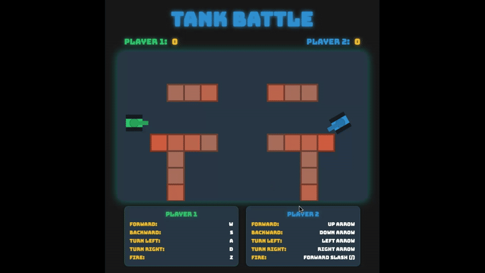

# Tank Battle

Tank Battle is a fast-paced two-player arcade game built with HTML5 canvas and vanilla JavaScript. Pilot stylized tanks across a barrier-strewn battlefield, dodge incoming fire, and line up the perfect shot to reach the winning score first.

## Features
- Responsive playfield that adapts to the browser window while keeping gameplay balanced.
- Local head-to-head tank combat with unique key bindings for each player.
- Procedurally generated, destructible barriers that reshape the arena every round.
- Particle-based explosion effects and Web Audio API sound design for shots, impacts, and destruction.
- Score tracking with automatic tank respawns so the action never stops.

## Controls
| Action | Player 1 (Green) | Player 2 (Blue) |
| --- | --- | --- |
| Move forward | `W` | Up Arrow |
| Move backward | `S` | Down Arrow |
| Turn left | `A` | Left Arrow |
| Turn right | `D` | Right Arrow |
| Fire | `Z` | `/` (forward slash) |

## Getting Started
1. Clone the repository: `git clone https://github.com/smithworx/tank.git`
2. Open `index.html` in any modern desktop browser (Chrome, Edge, Firefox, Safari).
   - For better audio autoplay support, serve the file with a lightweight dev server such as `npx serve` or VS Code Live Server.
3. Share the keyboard with a friend and start blasting.

## Gameplay Notes
- Tanks cannot pass through barriers or each other, so use obstacles for cover or to corner your opponent.
- Barriers take between one and three hits to break; watch for cracks to gauge remaining health.
- Audio contexts typically need a user action to start—pressing a movement or fire key will activate the sound effects if they are muted initially.

## Development
The entire experience lives in a single `index.html` file, keeping things easy to experiment with. Feel free to tweak constants like tank speed, bullet speed, or barrier density directly in the script to prototype new gameplay ideas.
